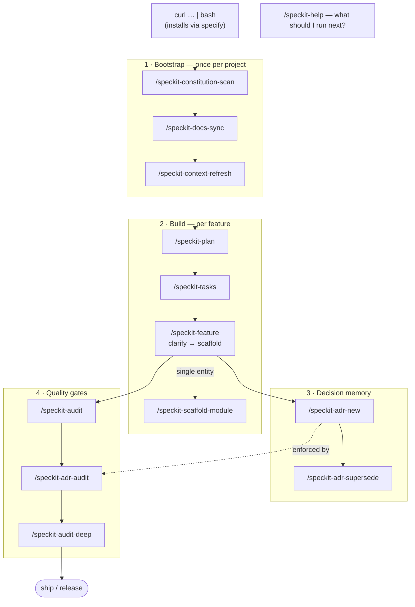

<div align="center">

# 🐍 speckit-python

**Spec-Driven Development for Python — done to a state-of-the-art standard.**

A constitution, slash commands, agent skills, a knowledge base, and ADR memory
that drive AI coding agents through type-safe, tested, reproducible Python.

Toolchain baseline: **uv · Ruff · mypy `--strict` · pytest**

</div>

---

## Quickstart

Install into any project with one line (it uses the spec-kit **`specify`** CLI under the hood):

```bash
curl -fsSL https://raw.githubusercontent.com/Satcomx00-x00/speckit-python/main/install.sh | bash
```

Then, inside that project (commands work in Claude Code and other agents):

```bash
/speckit-constitution-scan      # 1. generate the project's constitution from the repo
/speckit-docs-sync              # 2. wire AGENTS.md / CLAUDE.md / Copilot / Gemini
/speckit-feature payments       # 3. clarify → scaffold a fully typed feature slice
/speckit-audit                  # 4. check it against the constitution before the PR
```

Verify locally with the same tools CI runs:

```bash
uv run ruff check && uv run mypy --strict src && uv run pytest
```

<details>
<summary>Install options</summary>

```bash
# pick the agent and install auto-discovered skills instead of prompt files
curl -fsSL https://raw.githubusercontent.com/Satcomx00-x00/speckit-python/main/install.sh \
  | bash -s -- --target . --agent claude --skills

# preview the specify commands without running them
curl -fsSL https://raw.githubusercontent.com/Satcomx00-x00/speckit-python/main/install.sh \
  | bash -s -- --dry-run
```

`--agent` accepts `claude | copilot | gemini | codex | cursor`.
</details>

---

## Command flow



---

## Commands

| Phase | Command | Does |
|---|---|---|
| **Bootstrap** | `/speckit-constitution-scan` | Inventory the repo and export a phased Python constitution with a Sync Impact Report |
| | `/speckit-docs-sync` | Sync `AGENTS.md` / `CLAUDE.md` / Copilot / Gemini from the agent-context template |
| **Build** | `/speckit-plan` | Decompose a feature into layers, data flow, error taxonomy, and a testing plan |
| | `/speckit-tasks` | Turn a plan into a dependency-ordered task list with binary acceptance criteria |
| | `/speckit-feature` | **Clarify, then scaffold** a full typed feature slice (see below) |
| | `/speckit-scaffold-module` | Scaffold one typed module: contracts → domain → repository → service → tests |
| **Quality** | `/speckit-audit` | Audit the code against the constitution (regex rules) |
| | `/speckit-audit-deep` | Audit + `ruff` + `mypy --strict` + `pytest` + `pip-audit` + cross-file analysis |
| | `/speckit-adr-audit` | Check the code against accepted ADRs' forbid/require/prefer rules |
| **Decision memory** | `/speckit-adr-new` | Record a decision as a MADR 4 ADR under `docs/adr/` |
| | `/speckit-adr-supersede` | Replace an ADR, preserving the audit trail |
| | `/speckit-context-refresh` | Regenerate the one-page context pack the next session reads first |
| **Help** | `/speckit-help` | List commands by phase with a state-aware "suggested next" |

> Commands install dash-form for Claude Code (`/speckit-feature`) and ship in
> portable spec-kit form (`/speckit.feature`) under `presets/python/commands/`.

### ⭐ `/speckit-feature` — clarify, then scaffold

It **starts by asking up to five high-impact questions** (entity fields, surface,
persistence, async/sync, error style), each led by a recommended default — so an
ambiguous one-liner becomes a precise spec *before* any file is written. Then it
generates a layered, `mypy --strict`-clean slice:

```text
contracts.py  →  parse-don't-validate input + output DTOs
models.py     →  domain model: branded ids, frozen dataclasses, pure transitions
repository.py →  a Repository Protocol (DIP) + an in-memory adapter
service.py    →  pure use cases returning Result[T, E], dependencies injected
{router,cli,tasks}.py  →  a thin API / CLI / library / worker surface
tests/…       →  deterministic pytest unit tests, zero mocks
```

---

## Skills & knowledge base

The toolkit is **self-propelled** — it carries everything it installs:

- **Skills** (`skills/speckit-*/SKILL.md`) — [agentskills.io](https://agentskills.io)
  capabilities agents auto-discover by `name` + `description`. Generated from the
  commands by `scripts/build-skills.py` (single source of truth; `--check` guards drift).
- **Knowledge base** (`knowledge/`) — the constitution split into 11 deep-reference
  topics (`type-safety`, `security`, `testing`, …), each with directives + Do/Don't
  code patterns. Every sample passes `mypy --strict` and `ruff`. Skills load only the
  slice a task needs (progressive disclosure — zero context cost until read).

Every capability therefore has two surfaces — an explicit command (`/speckit-feature`)
and an auto-discovered skill (`speckit-feature`) — both backed by the knowledge base.

---

## Repository layout

```text
.
├── presets/python/        # the portable preset: constitution + agent-context + commands + scripts
├── skills/                # agentskills.io SKILL.md (generated from commands)
├── knowledge/             # the knowledge base — 11 deep-reference topics
├── docs/adr/              # Architecture Decision Records (MADR 4) + index
├── workflows/             # end-to-end python-feature delivery workflow
├── scripts/build-skills.py # regenerates skills/ from the commands
├── extension.yml          # spec-kit extension manifest (commands + skills + knowledge)
├── install.sh             # specify-driven, one-line installer
├── pyproject.toml         # canonical uv + Ruff + mypy(strict) + pytest config
└── AGENTS.md · CLAUDE.md  # always-on agent operating rules
```

---

## How it works

Spec-Driven Development inverts AI coding: the **specification is the source of
truth**, and the constitution makes "good Python" *machine-checkable* rather than
aspirational. mypy `--strict` proves type-safety, Ruff proves style and catches
security smells, uv proves reproducibility, pytest proves behavior — so
`/speckit-audit` and `/speckit-adr-audit` enforce the standard mechanically on
every change. The full directive lives in
[`presets/python/templates/constitution-template.md`](./presets/python/templates/constitution-template.md);
the rationale is recorded in [`docs/adr/`](./docs/adr/).

## License

[MIT](./LICENSE)
