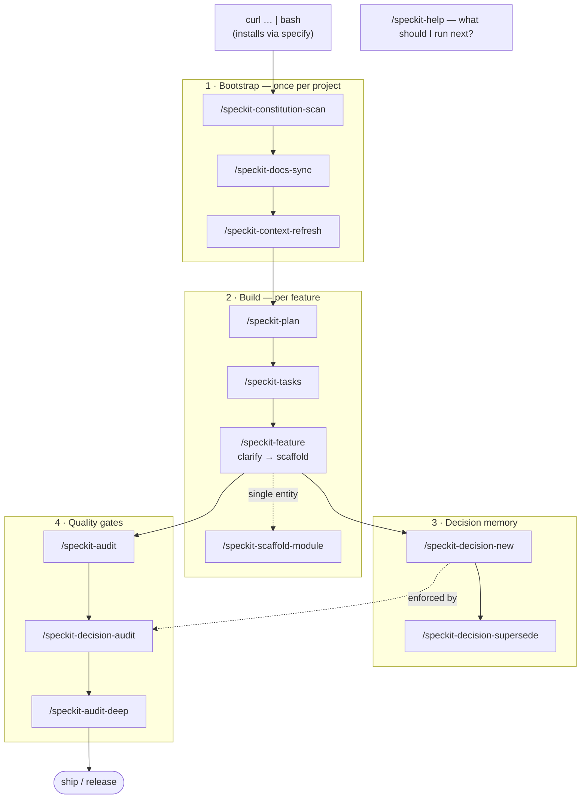

<div align="center">

# 🐍 speckit-python

**Spec-Driven Development for Python — done to a state-of-the-art standard.**

A constitution, slash commands, agent skills, a knowledge base, and ADR memory
that drive AI coding agents through type-safe, tested, reproducible Python.

Toolchain baseline: **uv · Ruff · mypy `--strict` · pytest**

</div>

---

## Quickstart

Install into any project with one line (it uses the spec-kit **`specify`** CLI under the hood):

```bash
curl -fsSL https://raw.githubusercontent.com/Satcomx00-x00/speckit-python/main/install.sh | bash
```

Then, inside that project (commands work in Claude Code and other agents):

```bash
/speckit-constitution-scan      # 1. generate the project's constitution from the repo
/speckit-docs-sync              # 2. wire AGENTS.md / CLAUDE.md / Copilot / Gemini
/speckit-feature payments       # 3. clarify → scaffold a fully typed feature slice
/speckit-audit                  # 4. check it against the constitution before the PR
```

Verify locally with the same tools CI runs:

```bash
uv run ruff check && uv run mypy --strict src && uv run pytest
```

<details>
<summary>Install options</summary>

```bash
# pick the agent and install auto-discovered skills instead of prompt files
curl -fsSL https://raw.githubusercontent.com/Satcomx00-x00/speckit-python/main/install.sh \
  | bash -s -- --target . --agent claude --skills

# preview the specify commands without running them
curl -fsSL https://raw.githubusercontent.com/Satcomx00-x00/speckit-python/main/install.sh \
  | bash -s -- --dry-run
```

`--agent` accepts `claude | copilot | gemini | codex | cursor`.
</details>

---

## Command flow



---

## Commands

Listed in the order you'd typically run them. The **Required?** column tells you
what the core loop needs versus what to run only when it applies:

- ✅ **Required** — part of the core path; do this.
- 🔶 **Recommended** — strongly advised, but you can skip it.
- ⚪ **Optional** — run only when the situation calls for it.

| # | Command | Phase | Required? | What it does |
|---|---|---|---|---|
| 1 | `/speckit-constitution-scan` | Bootstrap · once per project | ✅ Required | Inventory the repo and export a phased Python constitution with a Sync Impact Report |
| 2 | `/speckit-docs-sync` | Bootstrap · once per project | 🔶 Recommended | Sync `AGENTS.md` / `CLAUDE.md` / Copilot / Gemini from the agent-context template |
| 3 | `/speckit-context-refresh` | Bootstrap · then any new session | ⚪ Optional | Regenerate the one-page context pack the next session reads first |
| 4 | `/speckit-plan` | Build · per feature | 🔶 Recommended | Decompose a feature into layers, data flow, error taxonomy, and a testing plan |
| 5 | `/speckit-tasks` | Build · per feature | ⚪ Optional | Turn a plan into a dependency-ordered task list with binary acceptance criteria |
| 6 | `/speckit-feature` | Build · per feature | ✅ Required † | **Clarify, then scaffold** a full typed feature slice (see below) |
| 6′ | `/speckit-scaffold-module` | Build · per entity | ⚪ Optional † | Lighter alternative: scaffold one typed module — contracts → domain → repository → service → tests |
| 7 | `/speckit-decision-new` | Decision memory · when you decide | ⚪ Optional | Record an architectural decision as a MADR 4 ADR under `docs/adr/` |
| 8 | `/speckit-decision-supersede` | Decision memory · when a decision changes | ⚪ Optional | Replace an existing ADR, preserving the audit trail |
| 9 | `/speckit-audit` | Quality gate · before every PR | 🔶 Recommended | Audit the code against the constitution (regex rules) |
| 10 | `/speckit-decision-audit` | Quality gate · when ADRs exist | ⚪ Optional | Check the code against accepted ADRs' forbid/require/prefer rules |
| 11 | `/speckit-audit-deep` | Quality gate · before release | ⚪ Optional | Audit + `ruff` + `mypy --strict` + `pytest` + `pip-audit` + cross-file analysis |
| ⟳ | `/speckit-help` | Any time | ⚪ Optional | List commands by phase with a state-aware "suggested next" |

> † Step 6 is where code actually gets written: run **`/speckit-feature`** for a
> full feature slice, **or** `/speckit-scaffold-module` for a single entity — pick
> one. Everything before it is preparation; everything after it is verification.

> Commands install dash-form for Claude Code (`/speckit-feature`) and ship in
> portable spec-kit form (`/speckit.feature`) under `presets/python/commands/`.

### What each command does — and why it exists

- **`/speckit-constitution-scan`** — Reads your repo (layout, `pyproject.toml`,
  tooling, typing/async signals, CI) and writes a phased Python constitution.
  *Why:* every later command needs one machine-checkable definition of "good
  Python" to enforce, instead of leaving quality to taste.
- **`/speckit-docs-sync`** — Regenerates `AGENTS.md`, `CLAUDE.md`, Copilot, and
  Gemini context files from one template. *Why:* so every agent reads the same
  operating rules and they never drift apart.
- **`/speckit-context-refresh`** — Rebuilds the one-page context pack (ADR index,
  in-flight plans, recent changes, active waivers, constitution version). *Why:*
  a new AI session can load the whole project state from a single file instead of
  re-deriving it.
- **`/speckit-plan`** — Decomposes a feature into layers, data flow, an error
  taxonomy, and a testing plan before any code. *Why:* design decisions get made
  deliberately and reviewably, not improvised mid-scaffold.
- **`/speckit-tasks`** — Turns a plan into a dependency-ordered, checkable task
  list with binary acceptance criteria. *Why:* makes progress trackable and keeps
  the build honest about what "done" means.
- **`/speckit-feature`** — Clarifies (up to 5 questions), then scaffolds a full
  typed feature slice: contracts → models → repository → service → surface →
  tests. *Why:* this is the core builder — it turns an ambiguous request into a
  `mypy --strict`-clean, tested slice in one pass.
- **`/speckit-scaffold-module`** — The lighter alternative: one typed entity, no
  clarification round, no interface layer. *Why:* when you need a single model +
  repo + service + tests, not a whole feature.
- **`/speckit-decision-new`** — Records an architectural decision as a MADR 4 ADR
  under `docs/adr/`. *Why:* captures *why* a choice was made so it survives past
  the conversation and can be enforced later.
- **`/speckit-decision-supersede`** — Replaces an existing ADR while preserving
  the audit trail. *Why:* decisions change; the history of *why they changed*
  shouldn't be lost.
- **`/speckit-audit`** — Fast regex audit of the code against the constitution.
  *Why:* a quick, cheap gate to catch regressions before opening a PR.
- **`/speckit-decision-audit`** — Checks the code against accepted ADRs'
  forbid/require/prefer rules. *Why:* makes recorded decisions enforceable, not
  just documentation people forget.
- **`/speckit-audit-deep`** — The full gate: audit + `ruff` + `mypy --strict` +
  `pytest` + `pip-audit` + cross-file analysis. *Why:* highest-signal check to run
  before a release, when "probably fine" isn't good enough.
- **`/speckit-help`** — Lists commands by phase with a state-aware "suggested
  next". *Why:* so you (or a new contributor, human or AI) never have to guess
  which command comes next.

### ⭐ `/speckit-feature` — clarify, then scaffold

It **starts by asking up to five high-impact questions** (entity fields, surface,
persistence, async/sync, error style), each led by a recommended default — so an
ambiguous one-liner becomes a precise spec *before* any file is written. Then it
generates a layered, `mypy --strict`-clean slice:

```text
contracts.py  →  parse-don't-validate input + output DTOs
models.py     →  domain model: branded ids, frozen dataclasses, pure transitions
repository.py →  a Repository Protocol (DIP) + an in-memory adapter
service.py    →  pure use cases returning Result[T, E], dependencies injected
{router,cli,tasks}.py  →  a thin API / CLI / library / worker surface
tests/…       →  deterministic pytest unit tests, zero mocks
```

---

## Skills & knowledge base

The toolkit is **self-propelled** — it carries everything it installs:

- **Skills** (`skills/speckit-*/SKILL.md`) — [agentskills.io](https://agentskills.io)
  capabilities agents auto-discover by `name` + `description`. Generated from the
  commands by `scripts/build-skills.py` (single source of truth; `--check` guards drift).
- **Knowledge base** (`knowledge/`) — the constitution split into 11 deep-reference
  topics (`type-safety`, `security`, `testing`, …), each with directives + Do/Don't
  code patterns. Every sample passes `mypy --strict` and `ruff`. Skills load only the
  slice a task needs (progressive disclosure — zero context cost until read).

Every capability therefore has two surfaces — an explicit command (`/speckit-feature`)
and an auto-discovered skill (`speckit-feature`) — both backed by the knowledge base.

---

## Repository layout

```text
.
├── presets/python/        # the portable preset: constitution + agent-context + commands + scripts
├── skills/                # agentskills.io SKILL.md (generated from commands)
├── knowledge/             # the knowledge base — 11 deep-reference topics
├── docs/adr/              # Architecture Decision Records (MADR 4) + index
├── workflows/             # end-to-end python-feature delivery workflow
├── scripts/build-skills.py # regenerates skills/ from the commands
├── extension.yml          # spec-kit extension manifest (commands + skills + knowledge)
├── install.sh             # specify-driven, one-line installer
├── pyproject.toml         # canonical uv + Ruff + mypy(strict) + pytest config
└── AGENTS.md · CLAUDE.md  # always-on agent operating rules
```

---

## How it works

Spec-Driven Development inverts AI coding: the **specification is the source of
truth**, and the constitution makes "good Python" *machine-checkable* rather than
aspirational. mypy `--strict` proves type-safety, Ruff proves style and catches
security smells, uv proves reproducibility, pytest proves behavior — so
`/speckit-audit` and `/speckit-decision-audit` enforce the standard mechanically on
every change. The full directive lives in
[`presets/python/templates/constitution-template.md`](./presets/python/templates/constitution-template.md);
the rationale is recorded in [`docs/adr/`](./docs/adr/).

## License

[MIT](./LICENSE)
